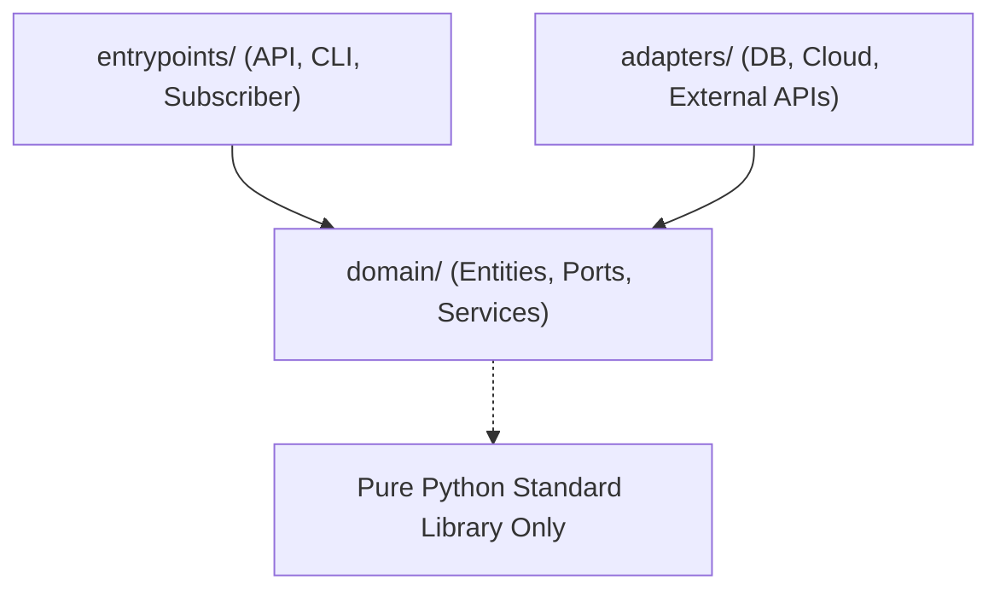

# Python Clean Architecture Code Layout Standard

This document defines the canonical directory structure and isolation boundaries for Python subsystems in Maestro.

---

## 1. Subsystem Directory Structure

Every subsystem lives in its own isolated module under `src/modules/<subsystem>/`:

```
src/modules/<subsystem>/
├── openapi.yaml                 # Frozen API contract (OpenAPI 3.1)
├── SPEC.md                      # Frozen behavioral specification & pattern declaration
├── __init__.py
├── domain/                      # PURE DOMAIN LAYER (Zero external I/O or framework imports)
│   ├── __init__.py
│   ├── models.py                # Immutable domain entities (@dataclass(frozen=True))
│   ├── exceptions.py            # Domain-specific typed exceptions
│   ├── ports.py                 # Abstract base interfaces (Repository ABC, Solver ABC, etc.)
│   ├── rules/                   # (If Decision-List pattern) 1 concrete Rule class per file
│   │   ├── __init__.py
│   │   ├── base_rule.py         # Abstract Rule port
│   │   ├── high_value_rule.py
│   │   └── default_rule.py
│   └── service.py               # (Or engine.py / pipeline.py / state_machine.py) Domain orchestrator
├── adapters/                    # SECONDARY PORTS & INFRASTRUCTURE IMPLEMENTATIONS
│   ├── __init__.py
│   ├── memory_repository.py     # In-memory test fake
│   ├── firestore_adapter.py     # Google Cloud Firestore adapter
│   └── pubsub_publisher.py      # Google Cloud Pub/Sub event emitter
└── entrypoints/                 # PRIMARY PORTS & CONTROLLERS
    ├── __init__.py
    ├── api.py                   # FastAPI / Flask HTTP router mapping openapi.yaml routes
    └── subscriber.py            # Pub/Sub push message handler
```

---

## 2. Test Suite Structure

Test suites mirror the clean architecture isolation layers:

```
tests/modules/<subsystem>/
├── unit/                        # Fast, in-memory unit tests (100% coverage requirement)
│   ├── __init__.py
│   ├── test_models.py
│   ├── test_rules.py
│   └── test_service.py
├── integration/                 # Adapter integration tests (against emulators or test fakes)
│   ├── __init__.py
│   └── test_adapters.py
└── contract/                    # Black-box API contract verification against openapi.yaml
    ├── __init__.py
    ├── test_contract.py         # Asserts every documented HTTP status code
    └── test_behavioral.py       # Asserts every PRD User Story requirement
```

---

## 3. Dependency Rule (Inward Direction Only)



* **Domain Core is Pure**: Code in `domain/` may **only** import standard library packages (e.g. `abc`, `dataclasses`, `enum`, `typing`, `uuid`, `datetime`). It **must never** import `fastapi`, `google.cloud`, `sqlalchemy`, `requests`, `pydantic` runtime I/O, or `adapters/`.
* **Adapters Implement Domain Ports**: Adapters depend on abstract interfaces defined in `domain/ports.py` or `domain/repository.py`.
* **Entrypoints Call Domain Services**: Controllers convert incoming HTTP/Event payloads into domain models, execute the domain service, and return serialized responses.
