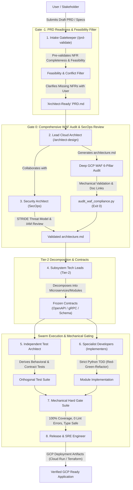
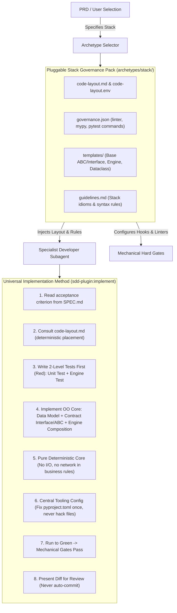

# Swarm Orchestrator Plugin: Architecture & Implementation Plan

## Goal Description
Build a production-grade agentic plugin (`swarm-orchestrator`) that automates end-to-end software delivery from a single PRD prompt. The system uses a **persona-driven multi-agent hierarchy**, **two-tier architectural decomposition**, **Google Cloud Well-Architected Framework (WAF) governance**, **orthogonal verification**, and **mechanical hard gates** to guarantee that generated Python applications achieve 100% linting, 100% unit test coverage via strict TDD, and are ready for Google Cloud Platform (GCP) deployment.

---

## Persona Taxonomy & Responsibilities

The plugin models a complete software engineering organization through specialized agent personas:



### 1. Intake Gatekeeper: Readiness & Feasibility Filter (`/prd-validate`)
* **Role**: Ingests user-provided PRD. Acts as an **Intake Sanity & Feasibility Filter** (Gate -1) to ensure the Lead Architect has unambiguous, achievable requirements:
  * **Completeness**: Checks that all Functional Requirements and NFR dimensions (Cost, Reliability, Security, Ops, Latency) are specified.
  * **Feasibility & Conflict Detection**: Flags contradictory constraints (e.g. multi-region active-active on a $50/mo budget, or sub-5ms latency on massive unindexed joins) before any architecture is designed.
  * **Interactive Clarification**: Prompts the user to resolve trade-offs and clarify omissions upfront.
* **Output**: Validated, unambiguous, and frozen `'Architect-Ready' PRD.md`.

### 2. Lead Cloud Architect: System Design & Deep WAF Compliance (`/architect-design`)
* **Role**: Ingests the Architect-Ready `PRD.md` and performs **Tier-1 Macro-Decomposition**.
* **Thorough WAF Architectural Audit (Gate 0)**:
  Evaluates the concrete proposed architecture against all **6 Google Cloud Architecture Framework (WAF) Pillars**:
  1. *System Design*: Cloud Run / GKE compute topology, storage engines (Firestore/Cloud SQL), async Pub/Sub event queues.
  2. *Operational Excellence*: Structured CloudOps JSON logging, Cloud Monitoring metrics, health checks, SLOs.
  3. *Security, Privacy & Compliance*: Zero-trust VPC-SC, Workload Identity, Secret Manager, Cloud KMS.
  4. *Reliability*: High availability, zonal redundancy, idempotency, retry/circuit breaker policies.
  5. *Cost Optimization*: Serverless scaling to zero, resource tuning, managed services over IaaS.
  6. *Performance Optimization*: Connection pooling, Memorystore caching, async processing.
* **Mechanical Validation**: `scripts/audit_waf_compliance.py` verifies all 6 pillars are addressed and cite official `cloud.google.com/architecture/framework/...` reference links.
* **Output**: `architecture.md` (System Topology, Tier-1 Subsystems, GCP Service Mappings, Mermaid Diagrams, Official WAF Citations).

### 3. Security Architect (SecOps)
* **Role**: Adversarial threat modeling and security posture validation.
* **Checks**:
  * STRIDE threat modeling on all external and inter-service boundaries.
  * IAM least-privilege definition (workload identity, service accounts).
  * Secret management (no plaintext credentials, strict Secret Manager integration).
  * Input sanitization, CORS, rate limiting, and OWASP Top 10 defenses.

### 4. Subsystem Tech Lead
* **Role**: Performs **Tier-2 Micro-Decomposition** on assigned subsystems.
* **Decomposition guardrail**: Default to a **modular monolith**. A separate service/microservice must be justified by a *named NFR driver* (independent scaling profile, distinct security/compliance boundary, or isolated failure domain). No split without one — every boundary added is another frozen contract and another independent verifier, so premature decomposition multiplies cost and conformance risk.
* **Computational Pattern Selection (Pluggable Domain Shapes)**:
  Avoid the "one hammer for all nails" anti-pattern. While the Rules Engine (`Rule(abc.ABC)` + `engine.py`) is an excellent default for predicate-evaluation workloads, the Tech Lead classifies each subsystem into its natural computational shape and selects the matching pattern from the **Maestro Domain Pattern Catalog**:
  1. **`decision-list` (Rules Engine / Chain-of-Responsibility)**: `Rule(abc.ABC)` + `engine.py` dispatcher. Best for validation, policy, eligibility, underwriting, pricing gates, and fraud/risk screening.
  2. **`repository-service` (CRUD / Key-Value / Query Service)**: Pure `Repository(abc.ABC)` interface + clean domain `Service`. Best for direct entity lookups, cache/datastore access, and basic CRUD without artificial rule overhead.
  3. **`state-machine` (Stateful Workflow / Saga / Lifecycle)**: Explicit `State`, `Event`, `TransitionTable`, and `StateMachine(abc.ABC)` handlers. Best for order lifecycles, booking flows, and multi-step distributed sagas with compensation.
  4. **`pipeline-reducer` (Data Pipeline / Stream Transformer)**: Linear/branching `PipelineStage(abc.ABC)` sequence consuming and returning transformed payloads. Best for stream windowing/aggregation (IoT telemetry), ETL, and accumulating calculators (stacked discounts $\to$ taxes $\to$ shipping).
  5. **`algorithmic-core` (Dedicated Solver / Strategy)**: Cohesive `Solver(abc.ABC)` or `Strategy(abc.ABC)` algorithm. Best for routing (Dijkstra/A*), AST parsing, compilers, scheduling, and mathematical/ML scoring without artificially fragmenting the algorithm.
* **Output**:
  * Breaks down macro-subsystems into discrete microservices, domain modules, or background workers.
  * Authors **Frozen Interface Contracts**:
    * REST APIs: `openapi.yaml` (strict types, status codes, error schemas).
    * RPC / Events: `*.proto` (gRPC), AsyncAPI / CloudEvents schemas.
    * Data Persistence: SQL DDL (`schema.sql`) or Firestore document schemas.
  * Authors **`SPEC.md`**: Tailored to the selected domain pattern, defining immutable domain models, pure domain interfaces, error taxonomies, and orthogonal acceptance scenarios.

### 5. Independent Test Architect (Orthogonal Verifier)
* **Role**: Derives test suites **strictly from the PRD and Contracts**, completely independent of the developer.
* **Gate of record**: The semantic-correctness gate is satisfied by *this* independent suite, **not** by the developer's self-authored TDD tests. A developer cannot green-light their own understanding of the requirements — self-tested code only proves internal consistency, not correctness against intent.
* **Output**:
  * Contract verification suites (validates schema conformance).
  * Behavioral integration tests (asserts business logic, idempotency, edge cases).
  * Load & NFR tests (validates performance boundaries).

### 6. Specialist Developers (Implementers)
* **Role**: Implement code within their strictly assigned directory boundary using **Strict TDD**.
* **Standards**:
  * Python 3.12+ modern typing (`typing.Annotated`, Pydantic V2, dataclasses).
  * Red-Green-Refactor loop: Write failing unit test $\to$ Write minimal code $\to$ Refactor. (These self-authored tests are development scaffolding; the correctness gate of record is the Independent Test Architect's suite — see persona 5.)
  * Never *unilaterally* modify contracts or write outside assigned module boundaries. If a contract defect is discovered, raise a **Contract Amendment Request** (see Orchestration Control) rather than implementing around it.

### 7. Release & SRE Engineer (GCP Deployer)
* **Role**: Generates Infrastructure as Code and deployment definitions.
* **Output**:
  * Terraform modules / Cloud Run service manifests (`service.yaml`).
  * Dockerfiles (multi-stage, non-root, minimal distroless/alpine images).
  * Cloud Build CI/CD pipeline definitions (`cloudbuild.yaml`).

---

## Non-Negotiables & Mechanical Hard Gates

| Gate | Tooling / Check | Trigger | Blocking Condition (Exit $\ne 0$) |
| :--- | :--- | :--- | :--- |
| **Gate 0: Architecture, WAF & ADRs** | `audit_waf_compliance.py` + `validate_adrs.py` | Pre-contract freezing (Controller-driven) | Any unaddressed WAF pillar, invalid MADR structure, or missing decision traceability |
| **Gate 0.5: Architecture Sign-Off (HITL)** | `validate_adrs.py --require-approval` | Pre-Gate 1 (Controller-driven) | Missing `Approved-by:` trailer in accepted ADRs |
| **Gate 1: Contract & Schema Consistency** | `validate_contract.py` | Post-Tier 2 decomposition (Controller-driven) | Schema syntax errors, unversioned endpoints, missing error models, missing SPEC pattern |
| **Gate 2: Directory Boundary Guard** | `scripts/hook_boundary_guard.py` | `PreToolUse` Hook on `write_to_file` & `replace_file_content` | Harness mechanically denies file write outside assigned `src/modules/<subsystem>/` |
| **Gate 3: Code Style & Quality** | `ruff check` + `ruff format --check` | Pre-commit / Task completion | Any lint or formatting violation (read-only in gate) |
| **Gate 4: Static Type Safety** | `mypy --strict` | Pre-commit / Task completion | Any typing error or implicit `Any` |
| **Gate 5: Unit Test Coverage** | `pytest --cov=src --cov-fail-under=100` | Pre-commit / Task completion | Coverage $< 100\%$ (branch + statement) or any test failure |
| **Gate 6: Mutation Adequacy** | `mutmut run` / `cosmic-ray` (scoped to changed modules) | Post-coverage | Surviving-mutant ratio above threshold |
| **Gate 7: Dependency & Code Security (SAST/SCA)** | `bandit` + `pip-audit` | Pre-commit / Task completion | High-severity static finding or known CVE |
| **Gate 8: Behavioral & Contract Coverage** | `audit_test_coverage.py` + contract tests | Integration phase (Controller-driven) | Missing status code tests, missing PRD User Story tests, or isolation leakage |
| **Gate 9: GCP IaC & Container Security** | `tflint` + `checkov` + Container scan | Deployment preparation | Security misconfiguration, running as root, exposed secrets |

---

## The Enforcement Architecture: Unbypassable Triggers vs. Ungameable Verdicts

Maestro makes a strict distinction between **verdict determinism** and **trigger determinism**:
* **Ungameable Verdicts**: Python auditor scripts (`scripts/*.py`) that return exit code `1` with machine diagnostics whenever code or specifications violate constraints.
* **Unbypassable Triggers**: External mechanisms outside LLM subagent discretion that guarantee gates are executed and cannot be skipped under task pressure:
  1. *Harness Lifecycle Hooks (`hooks.json`)*: `PreToolUse` hooks intercept tool calls at the runtime harness layer, blocking unauthorized file writes before they hit the filesystem.
  2. *Controller Phase-Progression Locks*: The Master Orchestrator (`/conduct`) runs gate suites between phases. The worker agent *never self-certifies*; state progression is hard locked on non-zero exit codes.
  3. *Git Pre-Commit Backstop*: Mechanical hook rejecting non-compliant commits at the VCS level.
  4. *Remediation Role Only*: `/gate-enforcer` is strictly a *remediation assistant* that diagnoses failures and orchestrates bounded retries; it has zero discretion to waive a failing gate.

---

## Orchestration Control: Budget, Remediation & Contract Amendments

The linear 6-phase flow describes the happy path. Real runs fail mid-swarm, and *how failure is handled* determines whether the system converges or burns tokens indefinitely. These controls are non-optional.

### Agent Budget
* The Master Orchestrator is given an **agent budget** (max total subagents) and a **concurrency cap**. It is encouraged to use the budget fully on high-value orthogonal work, not to waste it.
* Recursive Tech Leads receive a *fraction* of the parent budget for Tier-2 work. When the budget is exhausted, remaining work is serialized rather than spawned.
* The coordinator only ever manipulates **artifacts** (contracts, design docs, task specs) — never writes application code itself. All implementation happens in leaf subagents.

### Remediation Loop (what happens on a red gate)
* A failing gate returns its diagnostic to the **owning subagent**, which gets a **bounded number of fix attempts** (e.g. 3).
* Persistent failure escalates: subagent → parent Tech Lead → Master Orchestrator → **human**. No gate silently loops forever.
* **No silent truncation**: if work is dropped, capped, or deferred due to budget/attempt limits, the orchestrator must `log()` it explicitly. A partial delivery must never be presented as complete.

### Contract Amendment Escape Hatch
* Frozen contracts are authoritative but *not infallible* — the contract is unverified LLM output at the root, so implementers/verifiers will sometimes find genuine defects.
* "Never modify contracts" means **no unilateral edits**, not immutability. The controlled path: defect raised → Tech Lead triages → Architect re-validates against PRD/NFRs → contract re-frozen and **re-broadcast** → all dependent modules *and their tests* re-run through the gates.
* This prevents the worst failure mode: every gate passing green against a contract that specifies the wrong thing.

### Human Checkpoints (HITL Gates)
* The two highest-leverage moments — where an undetected error is cheapest to fix and most expensive to miss — are **after PRD structuring** (Gate -1) and **after Architecture & ADR freezing** (Gate 0 / Gate 0.5).
* Gate 0.5 mechanically verifies the presence of an **Approval Token** (`Status: accepted` + `Approved-by: <identity>`) in all active ADRs before unlocking Gate 1 contract decomposition.

---

## Pluggable Stack Governance & Implementation Discipline

Following the proven methodology in `sdd-plugin:implement`, the plugin decouples the **universal implementation method** from the **stack-specific language realization**. This makes best coding practices non-negotiable while allowing users to plug in any technology stack (Python, Go, TypeScript, Rust, etc.).



### 1. The Universal Method (Stack-Agnostic Invariants)
No matter what language is selected, worker subagents must obey these universal laws:
* **Harness Contract**: Code structure is governed by `.agents/conventions/code-layout.md` and `.agents/conventions/code-layout.env`. No improvised file paths.
* **Scope Discipline**: One acceptance criterion / rule per invocation. Never auto-advance or widen scope.
* **Two-Level Testing**: Tests must be written first (Red) at two distinct levels:
  1. *Isolated Unit Test*: The specific rule / module logic in isolation.
  2. *Engine / Entry-Point Test*: Driving the rule through the composite entry-point dispatcher.
* **Composition & Walking Skeleton**: The domain core is built around a composed engine (`engine.py`, `service.go`, etc.) that is runnable end-to-end from the very first rule.
* **Pure Business Core**: Domain logic is deterministic and decoupled from I/O, network calls, and database drivers.
* **Central Tooling Discipline**: Linter and typechecker rules are configured centrally in project manifests (`pyproject.toml`, `golangci.yml`, `tsconfig.json`), never bypassed with per-file inline disable comments.

### 2. The Pluggable Stack Archetype Structure
Each supported stack is encapsulated under `archetypes/<stack-name>/`:

```
archetypes/<stack-name>/
├── archetype.json                        # Stack metadata, commands (lint, typecheck, test, coverage threshold)
├── conventions/
│   ├── code-layout.md                    # Human-readable package and directory layout convention
│   └── code-layout.env                   # Machine-readable paths for pre-tool hooks
├── config/                               # Central tooling configs (pyproject.toml, .golangci.yml, tsconfig.json)
├── guidelines.md                         # Stack-specific idioms, syntax standards, and typing rules
└── templates/
    ├── patterns/                         # Domain Pattern Templates
    │   ├── decision-list/                # Base Rule(abc.ABC) + engine.py dispatcher
    │   ├── repository-service/           # Repository(abc.ABC) + service.py
    │   ├── state-machine/                # State, Event, TransitionTable + state_machine.py
    │   ├── pipeline-reducer/             # Stage(abc.ABC) + pipeline.py runner
    │   └── algorithmic-core/             # Solver(abc.ABC) / Strategy(abc.ABC)
    ├── model.*                           # Immutable data model template (dataclass, struct, type)
    └── test_template.*                   # Two-level test boilerplate
```

### 3. The Pattern Generation Model: Hidden Blueprints, Generated Code

Maestro is **install-and-use**: the end user never opens, copies, or edits a pattern file. Pattern knowledge is bundled *inside* the installed plugin and is invisible to the target project. This separates three artifacts that are easy to conflate:

| Artifact | Where it lives | Scope | Example content |
| :--- | :--- | :--- | :--- |
| **Blueprint** | `archetypes/<stack>/templates/patterns/<pattern>/` (inside the plugin) | Static; identical for every project; **never** copied into the user's repo | The canonical FSM shape: `trigger()` / `can_transition()` / guard logic + an *illustrative* transition table |
| **Spec** | `src/modules/<subsystem>/SPEC.md` (generated) | Per project; authored by the Tech Lead at Gate 1 | `pattern: state-machine` + the concrete states/events/transitions derived from the PRD |
| **Generated code** | `src/modules/<subsystem>/domain/…` (generated) | Per project; authored by the Implementer at Gate 2 | The customer's *real* `DRAFT → SUBMITTED → …` table as finished, 100%-tested production code |

**The blueprint carries the shape; the spec carries the domain; the Implementer fuses them.** The invariant machinery (engine / dispatcher / guard scaffolding) is reproduced near-verbatim from the blueprint because it does not vary between projects; only the domain-specific content (states, rules, entities, the transition table) is synthesized from the spec. This is why the plugin can bundle "all the logic to write the code" *without* pre-shipping any customer's business logic — that logic is not knowable until the PRD exists, so it is **generated, not bundled**.

Crucially, **the target repository only ever receives generated `src/modules/` code** — the `archetypes/` blueprints stay hidden inside the plugin. Those blueprints, together with `guidelines.md` and `conventions/`, double as the *author-facing* documentation for how a pattern works and how to add a sixth pattern or a new stack pack.

### 4. Built-in Stack Archetypes

#### A. Python 3.13 Clean Core & FastAPI (Default Reference)
* **Idioms**: `@dataclass(frozen=True)` / Pydantic V2, `abc.ABC` with `@abstractmethod`, pure domain core, 5 computational pattern templates.
* **Tooling**: `ruff check`, `ruff format --check`, `mypy --strict`, `pytest --cov --cov-fail-under=100`.
* **GCP Target**: Cloud Run (Stateless container), Eventarc / PubSub trigger, Secret Manager.

#### B. Go 1.24 Clean Architecture
* **Idioms**: Immutable structs, standard `interface`, Table-Driven Tests with `testing.T`, 5 computational pattern templates.
* **Tooling**: `golangci-lint run`, `go test -race -cover -covermode=atomic ./...`.
* **GCP Target**: Cloud Run minimal scratch container, Pub/Sub pull subscriber.

#### C. TypeScript / Node Strict
* **Idioms**: Readonly types, abstract classes / interfaces, composite handler registry, 5 computational pattern templates.
* **Tooling**: `eslint`, `tsc --noEmit`, `vitest --coverage`.
* **GCP Target**: Cloud Run / Cloud Functions.

---

## Proposed Plugin Structure (`/home/user/orchestrated-coding`)

```
/home/user/orchestrated-coding/
├── plugin.json                           # Plugin manifest (metadata, skills, hook bindings)
├── hooks.json                            # Lifecycle hooks (pre-tool boundary checks, pre-commit gates)
├── scripts/                              # Deterministic mechanical tools (Zero LLM bias)
│   ├── run_gate_suite.sh                 # Master hard gate orchestrator (dispatches to archetype gates)
│   ├── check_boundaries.py               # PreToolUse hook preventing cross-directory pollution
│   ├── validate_contract.py              # OpenAPI 3.x / Protobuf / JSON Schema syntax linter
│   ├── audit_waf_compliance.py           # Evaluates architecture against GCP WAF taxonomy
│   └── verify_contract_vs_prd.py         # Adversarial traceability check (FR/NFR -> Contract mapping)
├── archetypes/                           # Curated, Pluggable Stack Governance Packs
│   ├── python-fastapi-clean-arch/        # Python 3.13: Rule ABCs, dataclasses, engine.py, ruff, mypy, pytest
│   ├── go-clean-arch/                    # Go 1.24: Interfaces, table-driven tests, golangci-lint
│   └── ts-node-clean-arch/               # TypeScript: Strict types, vitest, eslint
└── skills/
    ├── conduct/                          # Master Conductor (Multi-phase state machine & swarm coordination)
    │   ├── SKILL.md
    │   └── references/                   # Subagent schemas, role prompts, phase transition rules
    ├── prd-validate/                     # Intake Gatekeeper Persona (PRD validation, WAF gap assessment & clarification)
    ├── architect-design/                 # Lead Architect Persona (Tier-1 Macro-Decomposition, GCP WAF Audit)
    ├── secops-audit/                     # Security Architect Persona (STRIDE threat modeling, IAM least-privilege)
    ├── lead-decompose/                   # Subsystem Tech Lead Persona (Tier-2 Micro-Decomposition, Contract Freezing)
    ├── test-architect/                   # Independent Test Architect Persona (Orthogonal Behavioral Test Generation)
    ├── code-implement/                   # Specialist Implementer Persona (Strict TDD Red-Green-Refactor)
    ├── gate-enforcer/                    # Gatekeeper Persona (Mechanical hard gate execution & diagnostic analysis)
    └── sre-deploy/                       # Release & SRE Persona (Cloud Run, Terraform IaC, Dockerfiles, Smoke Tests)
```

---

## The 6-Phase Master Execution Workflow

```
Phase 1: PRD Ingestion & PO Structuring
  └─ Ingests raw prompt, produces PRD.md (FRs + NFRs: Cost, Reliability, Security, Ops, Perf)

Phase 2: Tier-1 Macro-Decomposition & GCP WAF Review
  ├─ Architect creates architecture.md with subsystem topology & GCP product mapping
  ├─ SecOps audits threat model, IAM policies, and secret handling
  └─ Gate 0: GCP WAF Compliance Pass

Phase 3: Tier-2 Micro-Decomposition & Contract Freezing
  ├─ Subsystem Tech Leads decompose macro-services into microservices/modules
  ├─ Produce frozen openapi.yaml, proto definitions, and database schemas
  └─ Gate 1: Contract Consistency & Traceability Check

Phase 4: Swarm Dispatch & Orthogonal TDD Execution
  ├─ Launch Module Implementer Subagents (assigned to isolated subdirectories)
  ├─ Launch Independent Test Architect Subagents (generate orthogonal test suites)
  └─ Implementers execute strict TDD loop under boundary-enforcing hooks

Phase 5: Mechanical Hard Gate Suite
  ├─ Execute run_gate_suite.sh (Ruff + Mypy Strict + Pytest 100% Coverage + Mutation + Bandit/pip-audit + Contract Conformance)
  └─ On red: bounded remediation loop → escalate (subagent → Tech Lead → Orchestrator → human); no silent looping

Phase 6: Assembly, Cloud Deployment Scaffolding & Live Smoke Test
  ├─ SRE Subagent generates Terraform / Cloud Run / Cloud Build definitions
  ├─ Spin up local integration / test containers
  └─ Final Delivery artifact presented to user with deployment runbook
```

---

## Verification Plan

### Automated Tests for the Plugin
1. **Hook & Boundary Enforcement Tests**:
   * Verify that `check_boundaries.py` blocks an agent trying to write outside its module directory.
2. **Contract Validator Tests**:
   * Verify that `validate_contract.py` flags schema mismatches, unversioned endpoints, and missing error schemas.
3. **Hard Gate Runner Tests**:
   * Verify that `run_gate_suite.sh` fails if coverage is $< 100\%$ or if `mypy` detects untyped functions.
   * Verify the mutation gate fails on an assertion-free test suite that still hits 100% coverage (proves Gate 6 is meaningful).
   * Verify the security gate fails on a fixture with a known-vulnerable pinned dependency (`pip-audit`) and an injected `bandit` finding.
4. **Remediation & Escalation Tests**:
   * Verify a subagent that cannot pass a gate within its attempt budget escalates rather than looping, and that the drop is logged (no silent truncation).
5. **Archetype Integrity Tests**:
   * Run unit tests on `archetypes/python-fastapi-clean-arch/` to confirm that the baseline passes 100% linter and 100% test coverage out-of-the-box.

### End-to-End Simulation Run
* Run the `/conduct` skill against a sample PRD (e.g. *A high-throughput IoT device telemetry ingestion service deployed to GCP Cloud Run with Pub/Sub, Firestore, and an authenticated querying API*).
* Validate that:
  1. `architecture.md` addresses all NFRs against GCP WAF.
  2. Implementer and Verifier subagents execute in isolation.
  3. All mechanical gates pass with exit code `0`.

---

## Future Roadmap: Git Worktrees & Autonomous PR Lifecycle

To support multi-agent enterprise concurrency and real-world version control workflows, future phases will introduce:

1. **Git Worktree Isolation**:
   * Subagents execute in dedicated `git worktree` directories (`git worktree add ../feature-module-x`).
   * Eliminates workspace collision risks when multiple agents write and test code concurrently.
2. **Autonomous Conventional Commits & Traceability**:
   * Implementer subagents commit changes using conventional commits traceable to PRD acceptance criteria and rule IDs (e.g., `feat(ingest): implement rule R3 (deduplicate batches) [US1]`).
3. **Autonomous Pull Request (PR) & Review Lifecycle**:
   * Implementer subagents push feature branches and open PRs.
   * Independent Verifier and SecOps subagents review diffs, run gates, and post review comments via GitHub MCP integrations.
   * The Gatekeeper subagent merges PRs once all status checks and reviews are green.
4. **Autonomous Conflict Resolution**:
   * If upstream `main` advances, subagents pull the latest code and resolve merge conflicts against frozen contracts.

