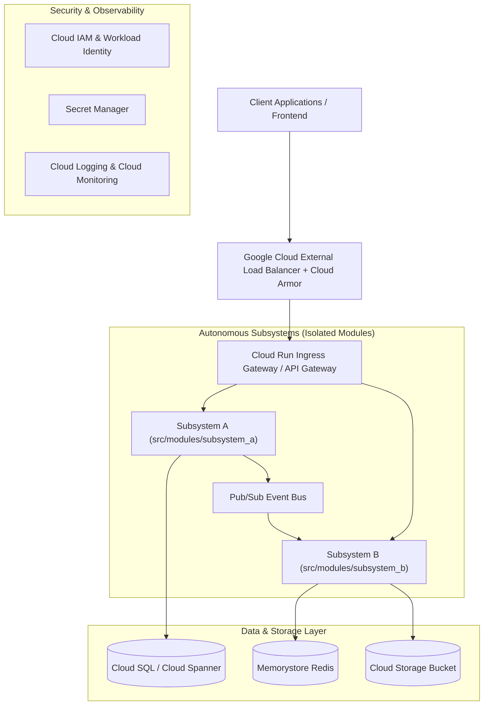

# System Architecture Specification: [Project Name]

> **Status**: `FROZEN / MACRO-ARCHITECTURE BASELINE (Gate 0)`  
> **Source**: Lead Cloud Architect (`/architect-design`)  
> **Contractual Input**: [`docs/PRD.md`](file:///home/user/orchestrated-coding/docs/PRD.md)  
> **Governance**: All downstream subsystem tech leads (`/lead-decompose`) and developers (`/implement`) must conform to the subsystem boundaries and WAF pillars defined herein.

---

## 1. Executive Summary & Macro-Topology
* **Architecture Vision**: Overview of the distributed system topology on Google Cloud.
* **Component Topology Diagram**:



---

## 2. Subsystem Macro-Decomposition
The architecture decomposes the system into autonomous subsystems to enable independent development and strict boundary enforcement:

| Subsystem Name | Directory Root | Core Responsibilities & Domain | Allowed External Dependencies | Assigned Worker |
|---|---|---|---|---|
| **[subsystem_a]** | `src/modules/[subsystem_a]/` | [Domain capabilities, entities, and business logic] | Cloud SQL, Pub/Sub | `subagent-[subsystem_a]` |
| **[subsystem_b]** | `src/modules/[subsystem_b]/` | [Domain capabilities, entities, and business logic] | Memorystore, Pub/Sub | `subagent-[subsystem_b]` |

---

## 3. Frozen Cloud Service Decisions
This table is the **authoritative, frozen** record of the concrete GCP products this architecture commits to. The mechanical Gate 0 auditor reads service selections from **this table only** — not from incidental prose. Every row MUST name a concrete GCP product (not a category like "a database") and MUST state the WAF driver that justifies it. Services deliberately *rejected* belong in Section 4 prose, never here.

| Architectural Concern | Chosen GCP Service | Rationale (WAF Driver) |
|---|---|---|
| Compute | [e.g. Cloud Run] | [e.g. Scale-to-zero serverless — Cost / System Design] |
| Primary Datastore | [e.g. Firestore] | [e.g. Serverless document store — System Design / Cost] |
| Perimeter / Security | [e.g. Cloud Armor] | [e.g. Rate limiting & DDoS defense — Security] |
| Secrets | [e.g. Secret Manager] | [e.g. Zero plaintext credentials — Security] |
| Observability | [e.g. Cloud Logging] | [e.g. Structured logs & SLO monitoring — Operational Excellence] |

---

## 4. Google Cloud Well-Architected Framework (WAF) Compliance

### 4.1 System Design
* **Compute Platform**: Serverless Cloud Run services configured with regional redundancy.
* **Storage & Database Selection**: Cloud SQL PostgreSQL for ACID relational data, Cloud Storage for artifacts.
* **Integration Patterns**: Asynchronous decoupled messaging via Google Cloud Pub/Sub with dead-letter queues.
* **Official Documentation Citation**: https://cloud.google.com/architecture/framework/system-design

### 4.2 Operational Excellence
* **Observability**: OpenTelemetry / Google Cloud Trace integration and structured JSON Cloud Logging.
* **SLO & Alerting Policies**: 99.9% availability target, latency alert thresholds, and automated error budgeting.
* **Deployment Automation**: Automated canary deployments via Cloud Deploy with health verification.
* **Official Documentation Citation**: https://cloud.google.com/architecture/framework/operational-excellence

### 4.3 Security, Privacy, and Compliance
* **Identity & Access Management (IAM)**: Principle of least privilege with Google Cloud Workload Identity Federation.
* **Perimeter Security**: Google Cloud Armor with WAF rules and rate limiting.
* **Secrets & Encryption**: Zero plaintext credentials; Google Cloud Secret Manager and CMEK encryption at rest.
* **Official Documentation Citation**: https://cloud.google.com/architecture/framework/security

### 4.4 Reliability and Disaster Recovery
* **Fault Tolerance**: Multi-zone regional deployments with automatic instance healing.
* **Data Resilience**: Automated daily Cloud SQL backups with cross-region read replicas.
* **Transient Error Handling**: Exponential backoff retries and idempotent API request handling.
* **Official Documentation Citation**: https://cloud.google.com/architecture/framework/reliability

### 4.5 Cost Optimization
* **Resource Scaling**: Scale-to-zero compute instances during off-peak periods.
* **Lifecycle Policies**: Automated Cloud Storage object lifecycle transitions to Coldline/Archive.
* **Cost Governance**: Cloud Billing budgets, alerts, and cost allocation labels per subsystem.
* **Official Documentation Citation**: https://cloud.google.com/architecture/framework/cost-optimization

### 4.6 Performance Optimization
* **Caching Strategy**: Google Cloud Memorystore Redis caching for high-frequency reads.
* **Connection Management**: Serverless VPC Access and connection pooling for Cloud SQL.
* **Official Documentation Citation**: https://cloud.google.com/architecture/framework/performance

### 4.7 Sustainability
* **Carbon-Efficient Region Selection**: Hosted in low-carbon Google Cloud regions (e.g. `europe-west1` or `us-central1`).
* **Resource Rightsizing**: Dynamic instance sizing to eliminate idle compute overhead.
* **Official Documentation Citation**: https://cloud.google.com/architecture/framework/sustainability

---

## 5. Cross-Cutting Infrastructural Blueprint
* **Networking & Ingress**: Dedicated VPC with Private Google Access and Cloud NAT for secure egress.
* **Authentication & Authorization**: OAuth2/OIDC token verification at the API gateway layer.
* **Auditability & Traceability**: Centralized audit logging via Cloud Audit Logs.

---

## 6. Gate 0 Verification & Subsystem Hand-Off
* **Mechanical WAF Gate**:
  ```bash
  python3 scripts/audit_waf_compliance.py architecture.md
  ```
* **Downstream Handoffs**:
  1. **Security Architect (`/secops-audit`)**: Reviews STRIDE threat model and IAM policies against `architecture.md`.
  2. **Subsystem Tech Lead (`/lead-decompose`)**: Generates subsystem OpenAPI specs and `SPEC.md` within `src/modules/<subsystem>/`.
