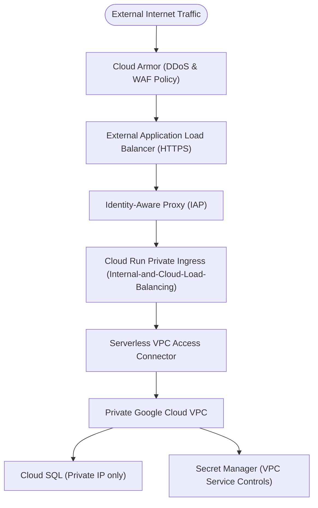

# Google Cloud Solution Architecture Patterns & Decision Matrices

This reference guide provides concrete decision trees, trade-off matrices, and reference topologies harvested from Google Cloud Solution Architecture best practices.

---

## 1. Compute Platform Decision Matrix

| Requirement / Driver | Cloud Run | Google Kubernetes Engine (GKE) | Compute Engine VMs | Cloud Functions |
|---|---|---|---|---|
| **Traffic Pattern** | Spiky, HTTP/gRPC, scales to 0 | High constant load, multi-protocol | Legacy OS dependencies, non-containerized | Lightweight event triggers |
| **Max Request Timeout** | 60 minutes | Unlimited | Unlimited | 9 minutes (HTTP) / 10m |
| **Startup Latency** | Milliseconds to seconds (cold start) | Pre-warmed pod pools | Minutes (VM boot) | Milliseconds |
| **Operational Model** | Serverless / Zero ops | Managed cluster (autopilot or standard) | IaaS / OS patching required | Serverless single-function |
| **Cost Profile** | Pay-per-request / CPU-second | Base cluster fee + node pricing | Hourly VM instance pricing | Pay-per-invocation |

---

## 2. Datastore Selection Decision Matrix

| Data Model & Access Pattern | Primary Service Selection | Secondary / Alternate | Key Architectural Trade-Offs |
|---|---|---|---|
| **Relational / ACID (Regional, < 30TB)** | **Cloud SQL** (PostgreSQL / MySQL) | AlloyDB | Managed replicas, connection limits, vertical scaling ceiling |
| **Relational / ACID (Global, Infinite Scale)** | **Cloud Spanner** | AlloyDB Omni | External consistency, multi-region synchronous replication, higher base cost |
| **Document NoSQL / Real-time sync** | **Firestore** (Native Mode) | Cloud Bigtable | Document model, expressive indexing, 1MB document size limit |
| **High-Throughput Time-Series / Key-Value (>10k QPS)** | **Cloud Bigtable** | Firestore | Sub-10ms read/write latency at scale, requires dedicated cluster sizing |
| **Analytical OLAP / Data Warehousing** | **BigQuery** | Bigtable | Serverless SQL queries across petabytes, columnar storage, not for OLTP |
| **Object / Blob Storage** | **Cloud Storage (GCS)** | Filestore | Standard/Nearline/Coldline tiers, strong read-after-write consistency |

---

## 3. Messaging & Event Ingestion Patterns

### Pattern A: Asynchronous Microservice Decoupling (Pub/Sub)
- **Use Case**: Decoupling producer subsystems from consumer subsystems.
- **Components**: Cloud Pub/Sub Topics & Subscriptions, Cloud Run push or pull endpoints.
- **Guarantee**: At-least-once delivery; consumer handlers **must be idempotent**.
- **Dead-Letter Topics (DLT)**: Mandatory for messages exceeding retry limits (`maxDeliveryAttempts: 5`).

### Pattern B: Event-Driven System Integration (Eventarc)
- **Use Case**: Routing cloud infrastructure events (GCS bucket uploads, Secret Manager rotations, BigQuery loads) to microservices.
- **Components**: Eventarc Triggers, Cloud Run receivers.

---

## 4. Security & Perimeter Architecture (Zero Trust)

### Security Checkpoints:
1. **No Public IPs on Datastores**: Cloud SQL and Firestore instances must restrict access to private VPC networks.
2. **KMS & Secrets Isolation**: Never store credentials or API keys in environment variables; resolve secrets at startup via Secret Manager.
3. **IAM Least Privilege**: Each microservice subsystem has a dedicated Service Account (`sa-<subsystem>@<project>.iam.gserviceaccount.com`).
