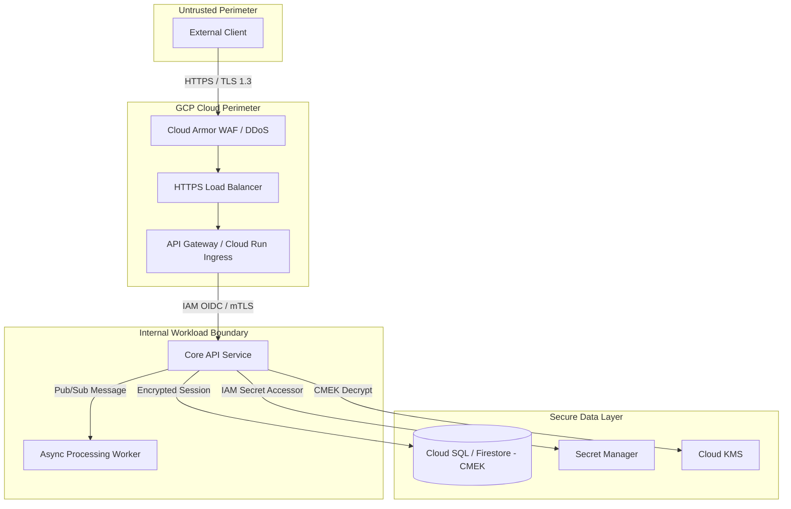

# Security Architecture & STRIDE Threat Model Template

This template defines the standard markdown structure for `docs/security.md` produced by the **Security Architect (`/secops-audit`)**.

---

```markdown
# Security Architecture & Threat Model Specification

## 1. Security Overview & Scope
* **Target Architecture**: docs/architecture.md
* **Reviewed Subsystems**: src/modules/<subsystem-1>/, src/modules/<subsystem-2>/
* **Classification**: Internal / Confidential / Public API
* **Compliance Standards**: Google Cloud WAF Security Pillar, OWASP API Top 10

---

## 2. Trust Boundaries & Data Flow Diagram


---

## 3. STRIDE Threat Analysis Matrix

| ID | Component / Boundary | STRIDE Category | Threat Description | Severity (H/M/L) | Mitigation Control | Verification Mechanism |
|:---|:---|:---|:---|:---|:---|:---|
| T-01 | Public Ingress | Spoofing | Unauthenticated client claims fake identity | High | OIDC JWT verification at API Gateway with strict signature check | Integration & contract test |
| T-02 | Message Bus | Tampering | Payload modified in transit | High | TLS 1.3 enforced on all Pub/Sub endpoints; payload signature | SAST & IAM binding audit |
| T-03 | Audit Trail | Repudiation | Admin denies modifying resource | Med | Google Cloud Audit Logs with immutable log sink | Cloud Logging policy review |
| T-04 | API Responses | Info Disclosure | Stack trace leaks internal paths | Med | Global exception handler formatting structured RFC 7807 errors | Unit & behavioral test |
| T-05 | Ingress Load Balancer | Denial of Service | HTTP flood / volumetric attack | High | Cloud Armor rate limiting rule (max 100 req/min per IP) | Cloud Armor policy spec |
| T-06 | Subsystem Service Account | Elevation of Priv | Compromised container accesses other tables | High | Dedicated SA per service; scoped IAM permissions (no Owner/Editor) | IAM role matrix check |

---

## 4. IAM Least-Privilege Role Matrix

| Subsystem / Service | Dedicated Service Account | Assigned GCP IAM Roles | Resource Scope |
|:---|:---|:---|:---|
| `api-ingress` | `sa-api-ingress@<proj>.iam.gserviceaccount.com` | `roles/run.invoker` | `projects/<proj>/locations/<loc>/services/*` |
| `<subsystem>-service` | `sa-<subsystem>@<proj>.iam.gserviceaccount.com` | `roles/datastore.user`, `roles/secretmanager.secretAccessor` | Subsystem Firestore DB & designated secrets |

---

## 5. Secret Inventory & Cryptographic Controls

| Secret Name | Storage Mechanism | Consumer Service Account | Encryption Standard | Rotation Schedule |
|:---|:---|:---|:---|:---|
| `db-password` | Google Cloud Secret Manager | `sa-<subsystem>` | Google Default / KMS CMEK | 90 Days |
| `jwt-private-key` | Google Cloud Secret Manager | `sa-auth-service` | Google Default / KMS CMEK | 180 Days |

---

## 6. OWASP API Top 10 Mitigation Summary
* **API1:2023 Broken Object Level Authorization (BOLA)**: Subsystem services validate tenant/ownership ID on every entity query.
* **API2:2023 Broken Authentication**: Centralized OIDC token validation; no long-lived static tokens.
* **API3:2023 Broken Object Property Level Authorization**: Strict Pydantic / dataclass schemas strip unexpected fields.
* **API4:2023 Unrestricted Resource Consumption**: Cloud Armor rate limiting + Cloud Run max instance ceilings.
* **API5:2023 Broken Function Level Authorization**: Admin endpoints require explicit admin role claim.
* **API6:2023 Unrestricted Access to Sensitive Business Flows**: CAPTCHA integration / rate limiting on sensitive actions.
* **API7:2023 Server Side Request Forgery (SSRF)**: Egress firewall rules and URL validation blocking private RFC 1918 IPs.
* **API8:2023 Security Misconfiguration**: Automated container scanning + non-root distroless containers.
* **API9:2023 Improper Inventory Management**: All API endpoints defined in versioned `openapi.yaml`.
* **API10:2023 Unsafe Consumption of APIs**: Outbound API calls validated against schemas with strict timeouts.
```
